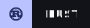
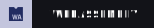

<div align="center">
    <h1>Website About Me</h1>
    
    
    
    <br />
    
</div>

## 🧩 Features
 - 🌗 Light/Dark theme
 - 🌐 I18n localization
 - 🛣️ Routing

## 📚 Stack
 - [Dioxus](https://dioxus.dev) - A Rust framework for building fast, cross-platform user interfaces with WebAssembly support.

## 🗃️ Project structure
```
👤 website-about-me
├─ 🖼️ assets
├─ 📦 src
├─── 🚀 app
├─── 🧩 components
├─── 🪝 hooks
├─── 🌐 locales
├─── 🎨 styles
├─── 👁️ pages
├─ 📄 README.md
├─ ⚙️ Cargo.toml
└─ 🪪 LICENSE
```

## 🏗️ How to build
 - Clone the repository
 - Run `dx serve` command
 - Enjoy the website on your web browser at `localhost:8080`