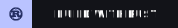
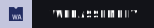
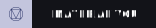
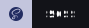

    <h1>Webite About Me</h1>
    
    
    
    
     
    

## 🧩 Features
 - 🌗 Light/Dark colorscheme
 - 🌐 I18n localization
 - 🛣️ Routing

## 🏗️ How to build
 - Clone repo
 - Run `dx serve` command
 - Enjoy the website on your web browser at `localhost:8080`
